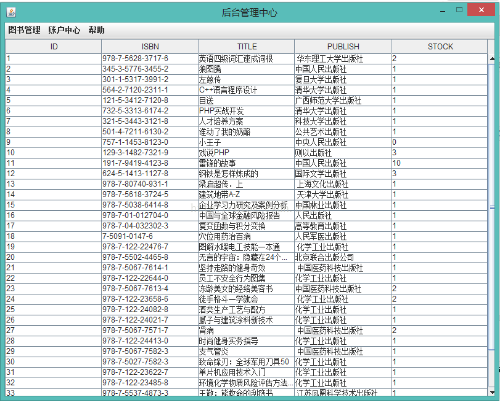

以前上学的时候写的图书管理系统，使用Java Swing GUI写的图形界面，结合MySQL数据库完成的图书管理系统项目，全部源码已经完成，下面是该项目的截图：

菜单截图

首页截图

后台截图

帮助中心截图

由于是刚刚接触Java的时候写的，并没有从整体架构上去考虑整个项目，所以代码很臃肿，很多可以面向对象的使用方法都被写了同一个类里，主要还是刚刚学完C导致没有很好理解面向对象编程的思路，但是至少是实现了想要的样子，供给大家参考参考，对你有帮助的话，点个星星吧！
重启项目